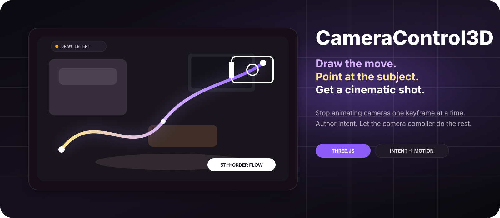
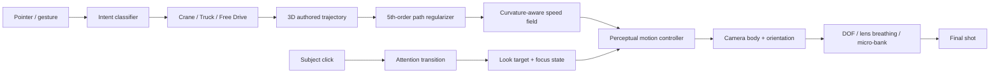

<p align="center">
  
</p>

<h1 align="center">CameraControl3D</h1>

<p align="center">
  <strong>Stop animating the camera. Start directing it.</strong><br/>
  Draw the move. Point at the subject. Let the motion compiler turn intent into a cinematic shot.
</p>

<p align="center">
  
  
  
  
  
</p>

---

## The idea

Most 3D camera tools make you think like an animation system:

`position` · `rotation` · `pan` · `tilt` · `zoom` · `easing` · `keyframes` · `curves`

CameraControl3D asks for something much smaller:

> **Where should the camera move — and what should it care about?**

That is the entire interaction thesis.

```text
you draw intent
      ↓
the system understands the move
      ↓
the path gains depth, timing and continuity
      ↓
the camera turns, settles and refocuses
      ↓
you get a shot
```

This is not trying to be another timeline-heavy camera editor.

It is an experiment in **camera direction as direct manipulation**.

---

## The 10-second loop

| 1 — Move | 2 — Look | 3 — Play |
| --- | --- | --- |
| Draw / steer directly in the 3D viewport | Click the thing you want the camera to care about | The system compiles the motion into a cinematic shot |
| Vertical intent becomes a crane move | Attention can change while the camera is already moving | Speed, turning, settling, focus and lens behavior are handled automatically |
| Horizontal intent becomes a truck move | Subject changes are transitions, not snaps | One-click stabilization can push the result into 5th-order flow |

> **The user is not keyframing a camera. The user is leaving a trail of cinematographic intent.**

---

## Why this feels different

### ✦ A line is not just a line

A vertical or horizontal stroke should not make the camera feel like a 2D viewport sliding over a picture.

CameraControl3D locks the dominant gesture direction, then restores a controlled amount of forward depth so the shot keeps **parallax, scale change and spatial presence** without turning into an unwanted orbit.

```text
vertical stroke
    ├── dominant crane motion
    └── subtle depth / parallax

horizontal stroke
    ├── dominant truck motion
    └── subtle depth / parallax

free diagonal stroke
    └── full depth-capable camera drive
```

The coordinate basis is captured when the gesture begins, so the control axes do not rotate underneath the pointer.

### ✦ Attention is separate from motion

A camera can travel one path while looking at different subjects over time.

During playback, click a semantic object and the camera can transfer attention toward it rather than snapping instantly.

That makes this possible:

> **Move through the room → notice the sofa → hand attention to the window → finish on the TV.**

No explicit look-at keyframe UI is required for the basic flow.

### ✦ Smoothness is treated as a state problem

Ordinary smoothing often fixes the visible path but leaves the movement feeling synthetic.

CameraControl3D currently models:

```text
position
  ↓
velocity
  ↓
acceleration
  ↓
jerk
  ↓
snap
  ↓
crackle
```

The offline path / speed field uses **fifth finite-difference regularization**. Runtime translation and orientation use bounded high-order state control.

The goal is not merely:

> “remove jitter”

It is:

> **make the camera feel like it has weight, anticipation and continuity.**

---

## What is already playable

- ✅ draw / steer camera movement directly in the main 3D viewport
- ✅ automatic Crane / Truck / depth-capable gesture interpretation
- ✅ spatial depth restored to axis-oriented moves
- ✅ subject-aware look direction
- ✅ live subject switching during playback
- ✅ rack-focus / depth-of-field response
- ✅ curvature-aware speed shaping
- ✅ predictive turn anticipation
- ✅ fifth-order path regularization
- ✅ fifth-order translation state
- ✅ fifth-order rotation state
- ✅ smooth terminal settling
- ✅ micro banking
- ✅ subtle lens breathing
- ✅ timeline scrubbing
- ✅ multi-shot playback
- ✅ Top / Side trajectory feedback
- ✅ GLB import
- ✅ original six-axis controls preserved under **Advanced**
- ✅ CI smoke test that serves and requests the real static app

---

## The motion compiler



The interesting part is the middle.

The project is exploring whether a camera tool can compile **human spatial intent** into a richer motion state without asking the user to expose every parameter explicitly.

---

## One button: make it feel better

The **stabilize** action is deliberately not a giant settings panel.

It currently combines:

- path regularization
- curvature-aware timing
- bounded acceleration
- jerk / snap / crackle control
- predictive turn entry
- smooth subject handoff
- rotation smoothing
- terminal landing

The button is labeled:

> **已防抖 · 五阶丝滑**

The point is not the number “5”.

The point is that higher-order continuity is treated as an implementation detail, not a burden placed on the user.

---

## Semantic attention

The built-in living-room scene exposes semantic targets such as:

`room` · `sofa` · `window` · `coffee table` · `TV / cabinet` · `plant`

The camera path and the attention path are intentionally separate.

That separation makes the interaction closer to directing:

> “keep moving — now look there.”

rather than editing two synchronized animation tracks by hand.

---

## The hidden power-user layer

The simplified interaction is not replacing camera mechanics. It is compiling down to them.

Open **Advanced** and the original control model is still available:

| Translation / lens | Orientation |
| --- | --- |
| Horizontal | Pan |
| Vertical | Tilt |
| Zoom | Rotate |

Speed, timing, acceleration, braking, shot points and look-at targets are also inspectable.

This matters because CameraControl3D is both:

1. a playable interaction experiment, and
2. an inspectable camera-motion workbench.

---

## Try it in 10 seconds

No build step. No framework install.

```bash
git clone https://github.com/hippoley/CameraControl3D.git
cd CameraControl3D
python -m http.server 4173
```

Open:

```text
http://127.0.0.1:4173/
```

Then try this:

1. drag almost straight upward;
2. drag horizontally;
3. draw a diagonal move;
4. press **Play**;
5. click another object while the shot is moving;
6. hit **一键防抖防止卡顿**;
7. replay and feel the difference.

If the result is mathematically smooth but still *feels* wrong, that is exactly the class of problem this project is built to investigate.

---

## Import your own scene

Use **Import GLB** in the top bar.

The current prototype keeps a procedural living room as the zero-setup testbed because camera quality is much easier to judge when the scene contains:

- foreground occlusion,
- mid-ground subjects,
- background structure,
- depth boundaries,
- objects that make parallax obvious.

A flat test scene can hide bad camera motion.

---

## Why not just use keyframes?

Keyframes are excellent when you already know the shot.

CameraControl3D is interested in the moment **before** that — when the user only knows the intention.

Traditional workflow:

```text
intent
→ translate it into camera parameters
→ create keyframes
→ edit curves
→ tweak timing
→ fix turns
→ fix focus
→ preview
→ repeat
```

CameraControl3D direction:

```text
intent
→ point / draw
→ preview
→ keep or correct
```

The compiler absorbs the missing cinematography.

---

## Design constraint

The project follows one hard rule:

> **Minimum mental work → maximum perceptual payoff.**

That means new capability should prefer:

- automatic interpretation over another mode,
- continuous gestures over parameter panels,
- semantic objects over coordinate values,
- perceptual correction over mathematical purity,
- inspectable automation over hidden magic.

If a feature needs three new buttons, it is probably not finished yet.

---

<details>
<summary><strong>Technical note — what “5th-order” means here</strong></summary>

The implementation currently uses fifth finite differences to regularize sampled path and speed states.

For a scalar sequence, the fifth finite-difference stencil is based on coefficients:

```text
[-1, 5, -10, 10, -5, 1]
```

The runtime controller carries high-order state for both translation and orientation and applies bounded derivative budgets.

The implementation also uses high-order boundary transitions for subject transfers and final settling so the camera does not arrive with an obvious last-frame correction.

This is a practical perceptual controller, not a claim that every final rendered trajectory is globally C⁵ under all saturations and constraints.

</details>

<details>
<summary><strong>Technical note — current stack</strong></summary>

- Three.js r180
- PerspectiveCamera
- OrbitControls for navigation mode
- GLTFLoader
- EffectComposer
- BokehPass
- OutputPass
- plain HTML / CSS / JavaScript
- GitHub Actions smoke test

There is intentionally very little framework surface area. The camera behavior is the product being tested.

</details>

---

## Repository

```text
CameraControl3D/
├── index.html
├── styles.css
├── app.js
├── docs/
│   └── hero.svg
├── README.md
└── .github/
    └── workflows/
        ├── ci.yml
        └── pages.yml
```

---

## Where this can go

CameraControl3D is being shaped toward a reusable camera-intent layer for:

- 3D spatial editors
- digital twins
- architectural walkthroughs
- product demos
- AI-generated storyboards
- interactive video
- game / simulation authoring
- agent-driven cinematography

A future camera agent should not output “pan = 3.2”.

It should be able to say:

> “Approach the table, rise slightly, reveal the window, then hand attention to the person entering from the right.”

…and have the runtime compile that into a shot.

That is the direction.

---

## Philosophy

> **用户不是在做 Camera Animation，而是在“指给镜头看”。**

> **The user should not have to animate the camera. The user should only have to show the camera what they mean.**

<p align="center">
  <strong>CameraControl3D</strong><br/>
  Intent in. Cinematic motion out.
</p>
